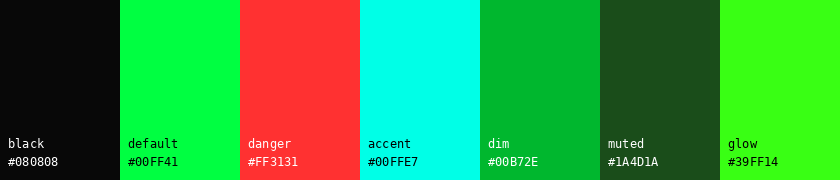

# Colors

| Name    | Hex       |
| ------- | --------- |
| black   | `#080808` |
| default | `#00ff41` |
| danger  | `#ff3131` |
| accent  | `#00ffe7` |
| dim     | `#00B72E` |
| muted   | `#1a4d1a` |
| glow    | `#39ff14` |
